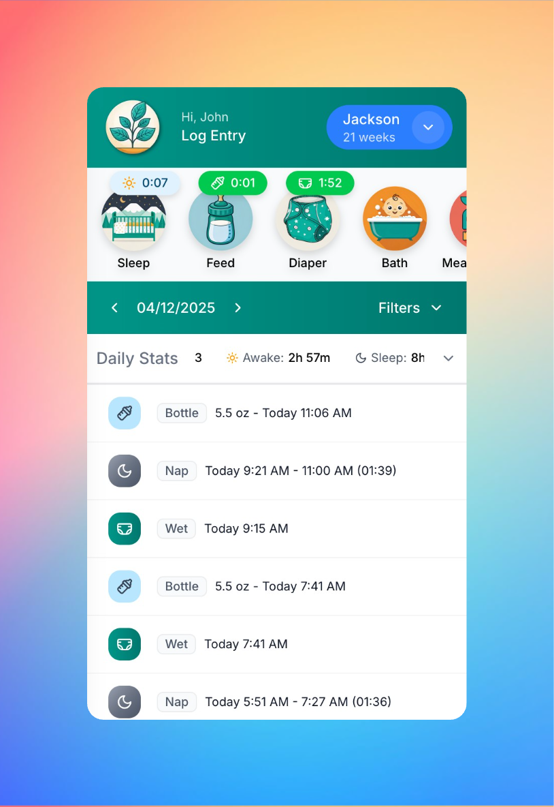
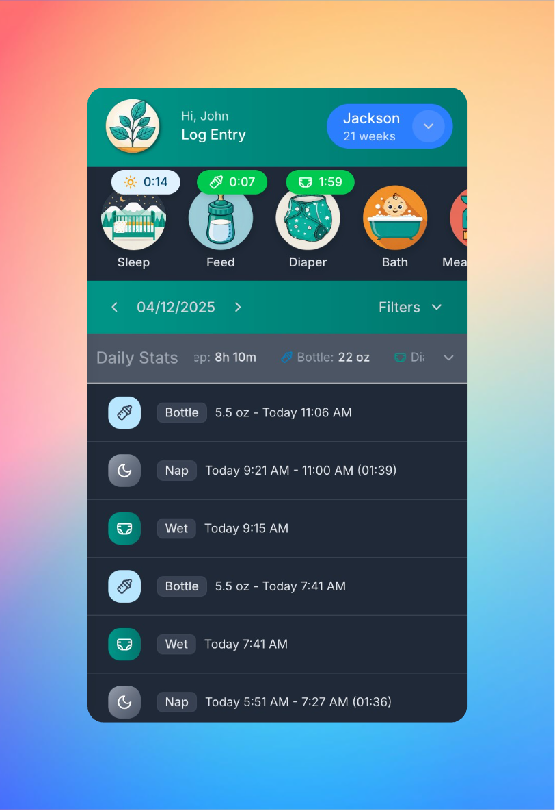
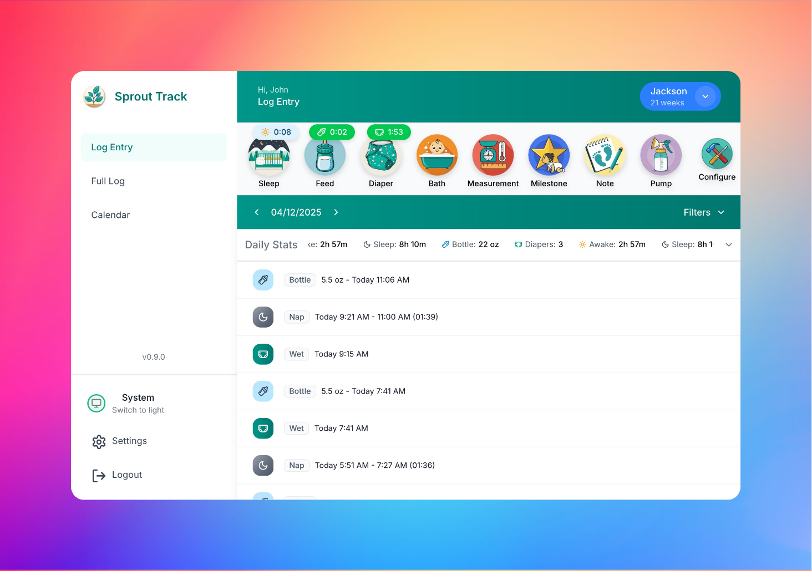
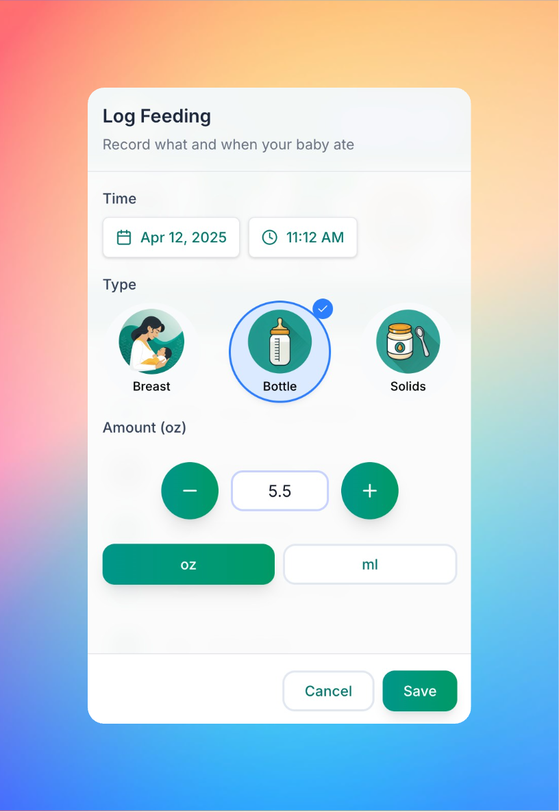
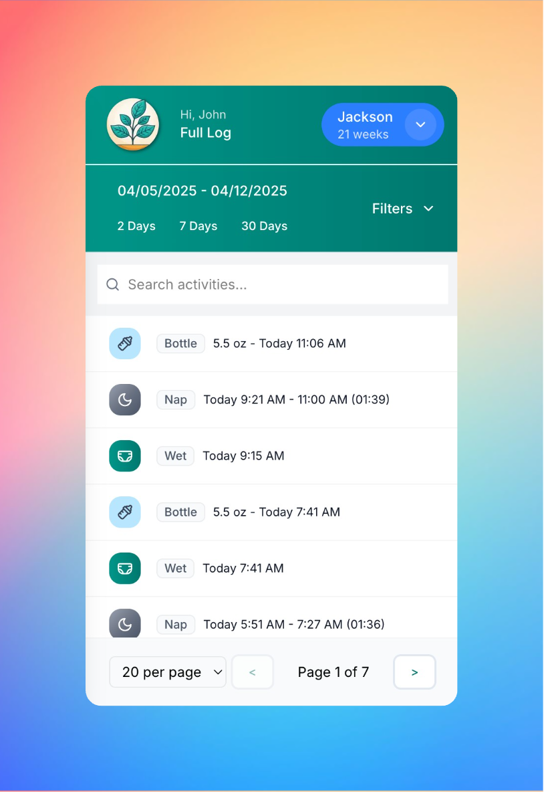
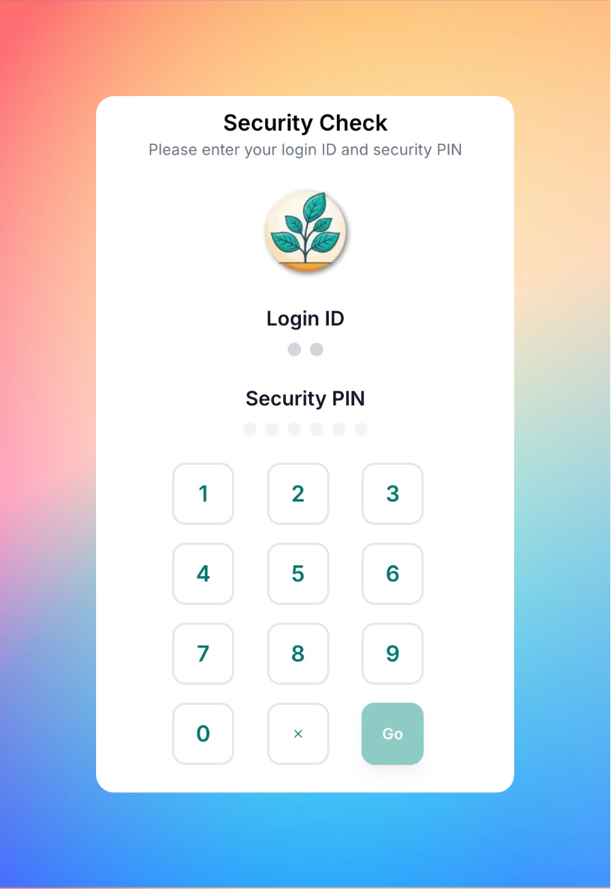
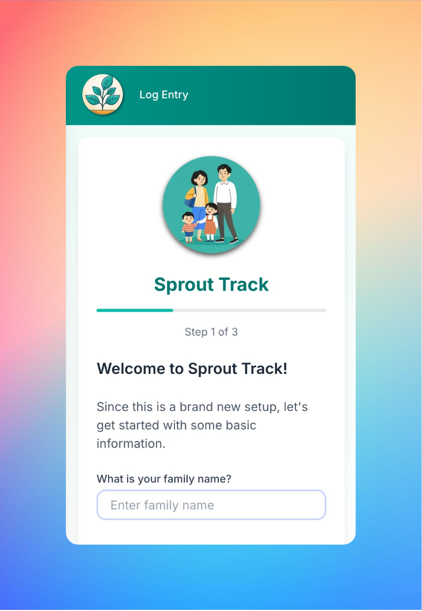

# Sprout Track

A Next.js application for tracking baby activities, milestones, and development.

### Mobile-First Design

*Mobile-first app for tracking your child's activities with an intuitive interface*


*Dark mode support for those late night feedings and minimal eye strain*


*Responsive design that adapts seamlessly to larger devices*

### Key Features

*Quick entry interface for logging activities with minimal effort*


*Comprehensive activity log with powerful search capabilities*


*Calendar functionality for tracking events, appointments, and reminders*

### Security & Setup

*Secure login screen with built-in IP-based lockout protection*


*User-friendly setup wizard for easy onboarding*

## Tech Stack

- Next.js with App Router
- TypeScript
- Prisma with SQLite (`/prisma`)
- TailwindCSS for styling
- React Query for data fetching
- React Hook Form for form handling

## Getting Started

### Prerequisites

- Git (to clone the repository)
- Bash shell (for running the setup script)

### Quick Setup (Recommended)

1. Clone the repository:
```bash
git clone https://github.com/Oak-and-Sprout/sprout-track.git
cd sprout-track
```

2. If deploying to a restricted directory (like /var/www), set proper permissions:
```bash
# For standard web server directories like /var/www
sudo chown -R $(whoami):$(whoami) .
# Or specify your web server user (e.g., www-data)
# sudo chown -R www-data:www-data .
```

3. Give execute permissions to the scripts folder:
```bash
chmod +x scripts/*.sh
```

4. Run the setup script:
```bash
./scripts/setup.sh
```

> **Note:** Do not run the setup script with sudo, as it installs Node.js for the current user. If you need to run as root, install Node.js system-wide first.

This setup script will:
- Check if Node.js is installed and install it if needed
- Install all dependencies
- Generate the Prisma client
- Run database migrations
- Seed the database with initial data (default PIN: 111222)
- Build the Next.js application

After setup completes, you can run the application in development or production mode as instructed in the setup output.

### Manual Setup (Alternative)

If you prefer to set up manually or the setup script doesn't work for your environment:

1. Ensure Node.js is installed (v22 recommended)

2. Install dependencies:
```bash
npm install
```

3. Generate Prisma client:
```bash
npm run prisma:generate
```

4. Run database migrations:
```bash
npm run prisma:migrate
```

5. Seed the database:
```bash
npm run prisma:seed
```

6. Build the application:
```bash
npm run build
```

7. Run the development server:
```bash
npm run dev
```

Open [http://localhost:3000](http://localhost:3000) with your browser to see the result.

### Default Security PIN

The default security PIN after setup is: **111222**

## Initial Application Setup

After installation, when you first access the application, you'll be guided through a setup wizard that helps you configure the essential settings for your Sprout Track instance.

### Setup Wizard

The application includes a built-in Setup Wizard (`src/components/SetupWizard`) that walks you through the following steps:

1. **Family Setup**
   - Enter your family name

2. **Security Setup**
   - Choose between a system-wide PIN or individual caretaker PINs
   - For system-wide PIN: Set a 6-10 digit PIN
   - For individual caretakers: Add caretakers with their own login IDs and PINs
     - First caretaker must be an admin
     - Each caretaker needs a 2-character login ID and 6-10 digit PIN

3. **Baby Setup**
   - Enter baby's information (first name, last name, birth date, gender)
   - Configure warning times for feeding and diaper changes
   - Default warning times: Feed (3 hours), Diaper (2 hours)

The Setup Wizard ensures your application is properly configured with the necessary security settings and initial data before you start tracking your baby's activities.

## Project Structure

- `/app` - Next.js app router pages and components
- `/prisma` - SQLite database and Prisma schema
- `/src/components` - Reusable UI components
- `/src/lib` - Utility functions and shared logic
- `/scripts` - Utility scripts for setup, deployment, and maintenance

## Available Scripts

### Development Scripts

- `npm run dev` - Start development server
- `npm run build` - Build for production
- `npm start` - Start production server
- `npm run lint` - Run ESLint

### Customizing Port Numbers

By default, the application runs on port 3000. To change the port:

1. Open `package.json` in your preferred text editor
2. Locate the "scripts" section
3. Modify the "dev" and/or "start" scripts to include the `-p` flag followed by your desired port number:

```json
"scripts": {
  "dev": "next dev -p 4000",  // Development server will run on port 4000
  "start": "next start -p 8080"  // Production server will run on port 8080
}
```

This change will persist across application updates. For Docker deployments, use the PORT environment variable as described in the Docker section.

### Database Scripts

- `npm run prisma:generate` - Generate Prisma client
- `npm run prisma:migrate` - Run database migrations
- `npm run prisma:seed` - Seed the database with initial data
- `npm run prisma:studio` - Open Prisma Studio to view/edit database

### Utility Scripts

- `./scripts/setup.sh` - Complete setup process (Node.js check, dependencies, database, build)
- `./scripts/backup.sh` - Create a backup of the application
- `./scripts/update.sh` - Update application (git pull, prisma operations, build)
- `./scripts/deployment.sh` - Full deployment process (backup + update)
- `./scripts/service.sh {start|stop|restart|status}` - Manage the application service

## Deployment

### Docker Deployment

The application can be easily deployed using Docker. This method provides a consistent environment and simplifies the setup process.

#### Prerequisites

- Docker and Docker Compose installed on your system
- Git to clone the repository

#### Quick Docker Setup

1. Clone the repository:
```bash
git clone https://github.com/Oak-and-Sprout/sprout-track.git
cd sprout-track
```

2. Make the Docker setup script executable:
```bash
chmod +x scripts/docker-setup.sh
```

3. Build the Docker image:
```bash
./scripts/docker-setup.sh build
```

4. Start the application:
```bash
./scripts/docker-setup.sh start
```

The application will be available at http://localhost:3000 by default.

#### Docker Management Commands

The `docker-setup.sh` script provides several commands to manage the Docker deployment:

- `./scripts/docker-setup.sh build` - Build the Docker image
- `./scripts/docker-setup.sh start` - Start the Docker containers
- `./scripts/docker-setup.sh stop` - Stop the Docker containers
- `./scripts/docker-setup.sh restart` - Restart the Docker containers
- `./scripts/docker-setup.sh logs` - View container logs
- `./scripts/docker-setup.sh status` - Check container status
- `./scripts/docker-setup.sh clean` - Remove containers, images, and volumes (caution: data loss)

You can customize the port by setting the PORT environment variable:
```bash
PORT=8080 ./scripts/docker-setup.sh start
```

#### Data Persistence

The application data is stored in a Docker volume named `sprout-track-db`. This ensures that your data persists even if the container is removed or rebuilt.

The application data is stored in a Docker volume named `sprout-track-db`. This ensures that your data persists even if the container is removed or rebuilt.

### Setting Up as a Linux Service

The application can be easily set up as a systemd service on Linux using the provided script:

```bash
./scripts/setup-service.sh
```

This script will:
1. Prompt you for a service name (default: sprout-track)
2. Prompt you for a port number (default: 3000)
3. Update package.json with the specified port
4. Create a systemd service file
5. Enable and start the service

The script requires sudo privileges to create and manage the systemd service.

### Prerequisites

1. Linux system with systemd
2. Node.js installed (v22 recommended)
3. Sudo privileges for service management
4. Make deployment scripts executable:
```bash
chmod +x scripts/*.sh
```

### Deployment Scripts

The following deployment scripts are available in the `Scripts` directory:

- `service.sh {start|stop|restart|status}` - Manage the application service
- `backup.sh` - Create a backup of the application
- `update.sh` - Update application (git pull, prisma operations, build)
- `deployment.sh` - Full deployment process (backup + update)

### Running a Deployment

For a full deployment process:
```bash
./scripts/deployment.sh
```

This will:
1. Create a backup of the current application
2. Pull latest changes from git
3. Run Prisma operations
4. Build the application
5. Manage service stop/start as needed

Each script can also be run independently for specific operations.
